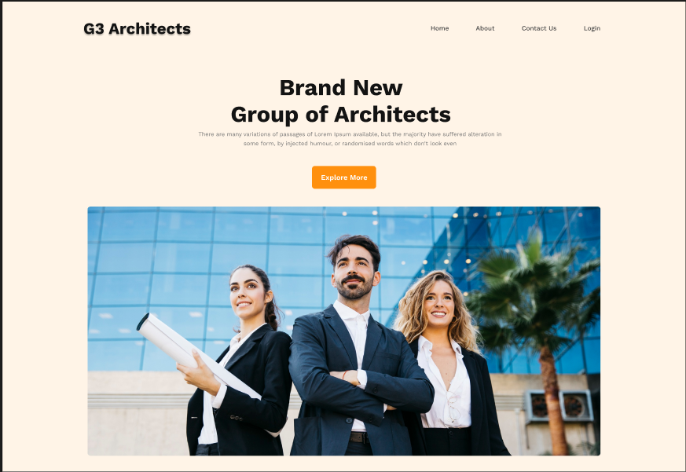

## 📸 Screenshots

### Homepage

  

# G3-Architects

A modern, responsive architecture website built with React.js, Vite, React Router, and Tailwind CSS. The project focuses on a clean UI, responsive layouts, reusable components, and a smooth user experience across devices.

# Live Website: 
 https://g3-architectsapp.netlify.app/

# Features
 Fully responsive design
 Modern architecture-focused landing page
 Responsive navigation bar
 Login page
 Contact page
 About page
 Fast development and production build with Vite
 Tailwind CSS styling
 Reusable loading spinner component
 Reusable React components
 Netlify deployment ready

 | Technology       | Purpose                     |
| ---------------- | --------------------------- |
| React.js         | Frontend UI                 |
| Vite             | Development & build tool    |
| Tailwind CSS     | Styling & responsive design |
| React Router DOM | Client-side routing         |
| JavaScript       | Application logic           |
| HTML5            | Structure                   |
| Netlify          | Deployment                  |
